---
{
	"title": "Card Sorting The Richland Library Information Architecture",
	"date": "2016-08-18",
	"client": "Richland Library"
}
---

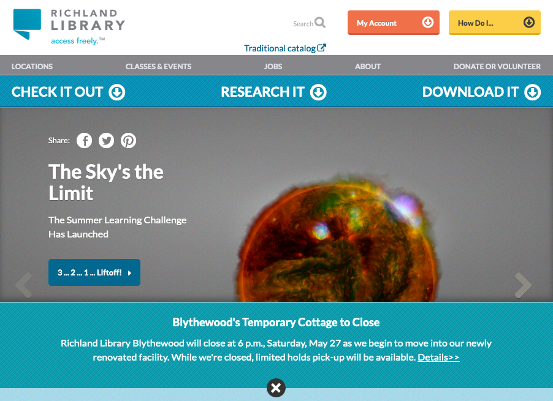

Hands-down the biggest card sort I have ever conducted was for [richlandlibrary.com](https://richlandlibrary.com). I conducted countless usability tests between 2015-2018 which ultimately led to a website redesign. The marketing department and librarians from the 12 (at the time) locations, all had vested interests in their own sections featured either in the main menu or on the front page. As such this was a very touchy subject internally, requiring feedback and involvement from a lot of people. Since the user base of richlandlibrary.com was at the time in the tens of thousands a day and in the top 1 million most viewed websites on the web, we figured that a non-zero amount of usability research with customers was necessary.

## Selecting The Cards

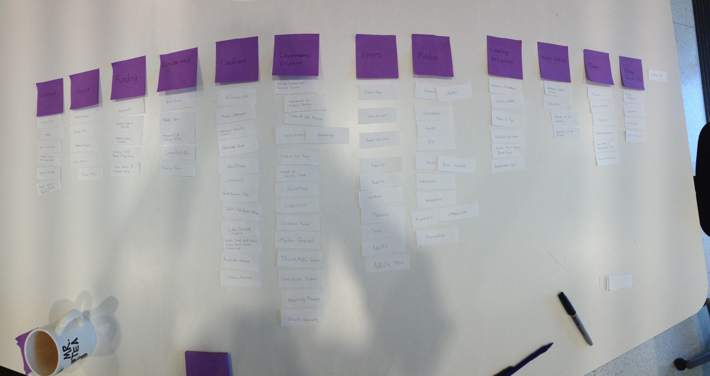

I collected the most trafficed sections of the site based on analytics as well as the original main menu items. There was also a push for improving the events calendar, and I noticed that the same age groups were repeated in the browsing sections as well as for filters, and figured we could deduplicate those cards somehow, and thus they were worth including. We started with paper, using labels verbatim. There were 90 cards.

## The Beauty of the free online 30 card sort

After the initial pass on paper, we felt we could reduce the number of cards to make tests go faster. The first way to make the sorts smaller was to separate the concerns between the events calendar efforts and the rest of the website. The second way, was by conducting just enough paper sorts to figure out what was obvious so we could reduce the number of cards to 30. Somewhere between 20 and 40 and no more than 120 seems to be the sweetspot, and 30 cards happens to be the limit of cards when using [Optimal Workshop](http://optimalworkshop.com) on a free account. We chose Optimal Workshop not only because it had a free tier, but at the time was the most feature rich, and tested as the easiest tool to use for staff and customers.

_The links below point to archive.org snapshots._

<ol class="grid-of-cards">
  <li><a href="https://web.archive.org/web/20180428192407/http://www.richlandlibrary.com/download-it/ebooks">A link to browse through eBooks</a></li>
  <li><a href="https://web.archive.org/web/20180428192407/http://www.richlandlibrary.com/jobs">Business Careers and Research Center</a></li>
  <li><a href="https://web.archive.org/web/20180428192407/http://www.richlandlibrary.com/research-it/career-job-resources">Career &amp; Job Resources</a></li>
  <li><a href="https://web.archive.org/web/20180428192407/http://www.richlandlibrary.com/ask-us/answer/462867">Fill out a form to request an obituary</a></li>
  <li><a href="https://web.archive.org/web/20180428192407/http://www.richlandlibrary.com/check-it-out/books">Find books to check out</a></li>
  <li><a href="https://web.archive.org/web/20180428192407/http://www.richlandlibrary.com/events">Upcoming events</a></li>
  <li><a href="https://web.archive.org/web/20180428192407/http://www.richlandlibrary.com/events">Sign up for classes</a></li>
  <li><a href="https://web.archive.org/web/20180428192407/http://www.richlandlibrary.com/check-it-out/movies">Movies that can be picked up from the library</a></li>
  <li><a href="https://web.archive.org/web/20180428192407/http://www.richlandlibrary.com/careers">Work at Richland Library</a></li>
  <li><a href="https://web.archive.org/web/20180428192407/http://www.richlandlibrary.com/research-it/genealogy">The department of Local History at Main</a></li>
  <li><a href="https://web.archive.org/web/20180428192407/http://www.richlandlibrary.com/download-it/music">Music downloads</a></li>
  <li><a href="https://web.archive.org/web/20180428192407/http://www.richlandlibrary.com/request-purchase">Request a purchase</a></li>
  <li><a href="https://web.archive.org/web/20180428192407/http://www.richlandlibrary.com/check-it-out/audiobooks?menu=download-it">Audiobooks you can check-out online</a></li>
  <li><a href="https://web.archive.org/web/20180428192407/http://www.richlandlibrary.com/ask-us">Send a question to a librarian</a></li>
  <li><a href="https://web.archive.org/web/20180428192407/http://www.richlandlibrary.com/download-it">Compare information between services that offer e-magazines</a></li>
  <li><a href="https://web.archive.org/web/20180428192407/http://www.richlandlibrary.com/locations">Addresses for our library locations</a></li>
  <li><a href="https://web.archive.org/web/20180428192407/http://www.richlandlibrary.com/locations">The typical posted hours of operation</a></li>
  <li><a href="https://web.archive.org/web/20180428192407/http://www.richlandlibrary.com/ask-us/answer/489830">Sign up for a library card</a></li>
  <li><a href="https://web.archive.org/web/20180428192407/http://www.richlandlibrary.com/services/reserve-room">Reserve a meeting room</a></li>
  <li><a href="https://web.archive.org/web/20180428192407/http://www.richlandlibrary.com/summer">Summer Learning Challenge</a></li>
  <li><a href="https://web.archive.org/web/20180428192407/http://www.richlandlibrary.com/sites/default/files/media-room/meet_the_media_box_faqs_april_2015_0.pdf">Meet the Media Box, a self-service machine for new release movies and games</a></li>
  <li><a href="https://web.archive.org/web/20180428192407/http://www.richlandlibrary.com/donate-or-volunteer">Volunteering at the library</a></li>
  <li><a href="https://web.archive.org/web/20180428192407/http://www.richlandlibrary.com/donate-or-volunteer">Donate books to the catalog or items of historical significance for archiving</a></li>
  <li><a href="https://web.archive.org/web/20180428192407/http://www.richlandlibrary.com/services/reserve-room">Sign up to use a desk in the co-working space</a></li>
  <li><a href="https://web.archive.org/web/20180428192407/http://www.richlandlibrary.com/check-it-out/teens">Things you can use our teen centers for</a></li>
  <li><a href="https://web.archive.org/web/20180428192407/http://www.richlandlibrary.com/download-it">How to connect your e-reader to services like Amazon, Hoopla, or Zinio</a></li>
  <li><a href="https://web.archive.org/web/20180428192407/https://www.richlandlibrary.com/ask-us/answer/638981">Ways that you can pay your fines</a></li>
  <li><a href="https://web.archive.org/web/20180428192407/http://www.buildingyourlibrary.com">Construction progress</a></li>
  <li><a href="https://web.archive.org/web/20180428192407/http://richlandlibrary.com/services/social-work">Get assistance from certified social workers with health insurance, housing, etc.</a></li>
  <li><a href="https://web.archive.org/web/20180428192407/http://www.richlandlibrary.com/inform/school-summer-reading-lists-2016">School summer reading list</a></li>
</ol>

## Responses

The sample size was small, at about a 20 participants I believe. I was sure to mix both staff and random customers I would pull off to the side for 15 minutes or so. I recommend small mixed samples to anyone starting from zero usability testing data as it's a good way to show colleagues and stakeholders how their ideal solutions match up with their end users mental models. And, to stay within the limits of the free tier, I would run the study once on internal stakeholders, get the output, duplicate, and then run it again.

The responses converged on 2 major categories as evidenced by the dendrograms below:

1.  "General Resources" (the catalog)
    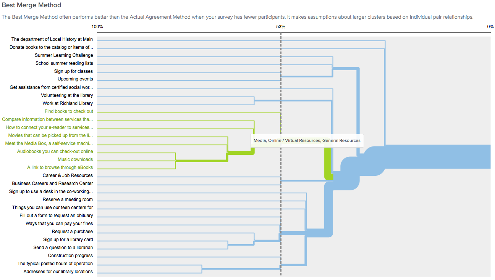

2.  "Library Information" (the library itself)
    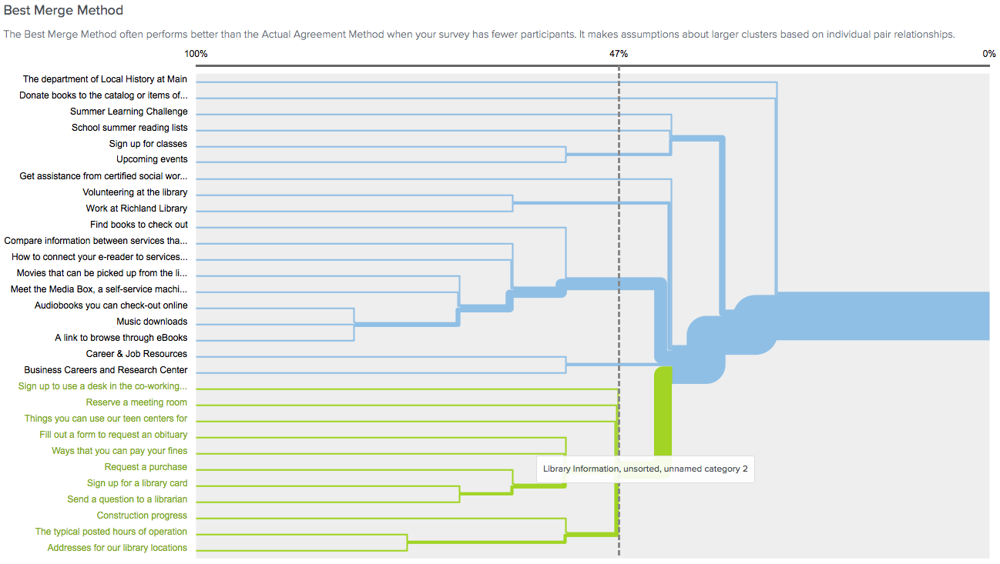

No real surprises there. Though, it was interesting that this was not how the website was organized already. There were also various minor categories.

1.  Get Involved (volunteering/working at the library)
    

2.  Business and Careers (volunteering/working elsewhere)
    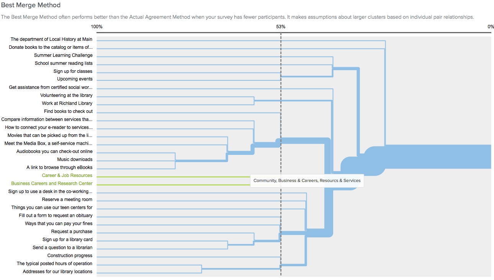

3.  Events
    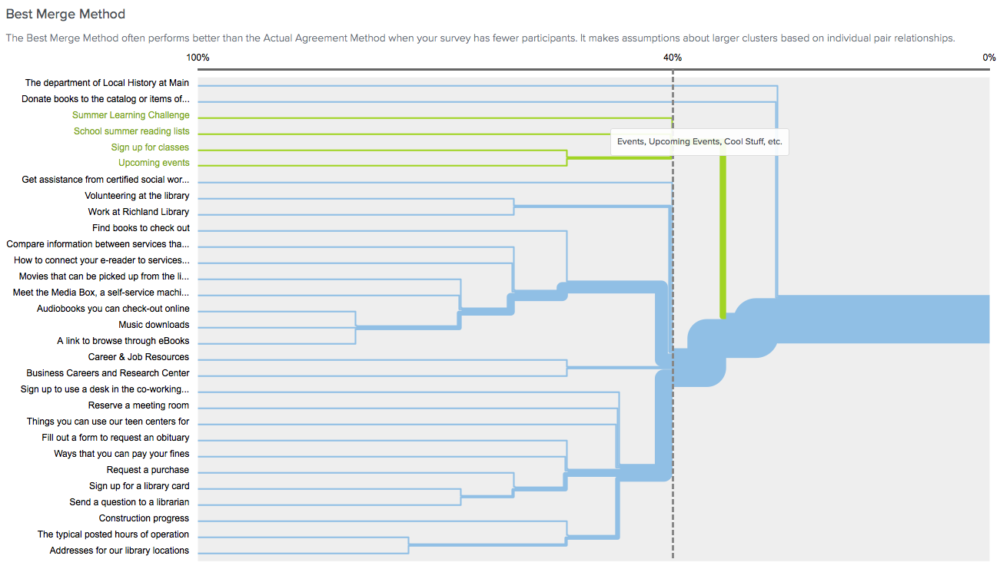

Last, there were disagreements that fell outside of the above categories. The benefit of having a larger sample size is that these problem areas would have been more easily resolved by seeing overwhelming trends that reduce their impact.

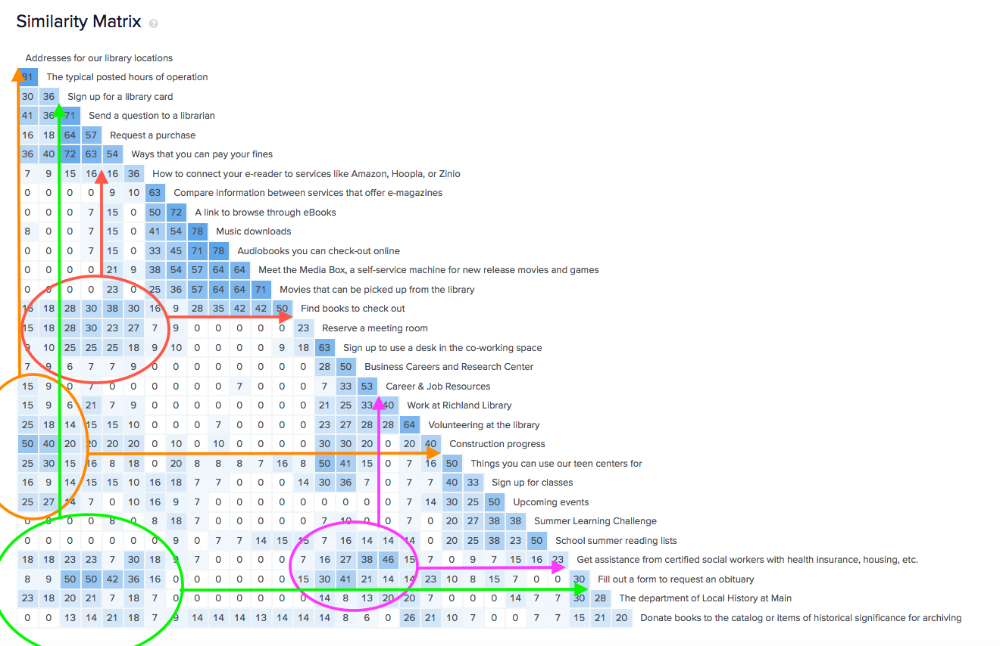

- 50% Library Locations & construction updates
- 50% Sign up for a library card & Request an obituary
- 50% Ask a librarian & Request an obituary
- 46% Career and Job Resources & Social Worker Assistance
- 40% Hours of Operation & Construction updates
- 38% Request a Purchase & Finding Books

# Going Big

The 30 card sort would pave the way for a much larger one, but since card sorts start to break down past 30 cards, some creative solutions were necessary. Another limitation I had to work with was that there was zero budget. So we went back to paper and spreadsheets.

## Capturing The Sitemap

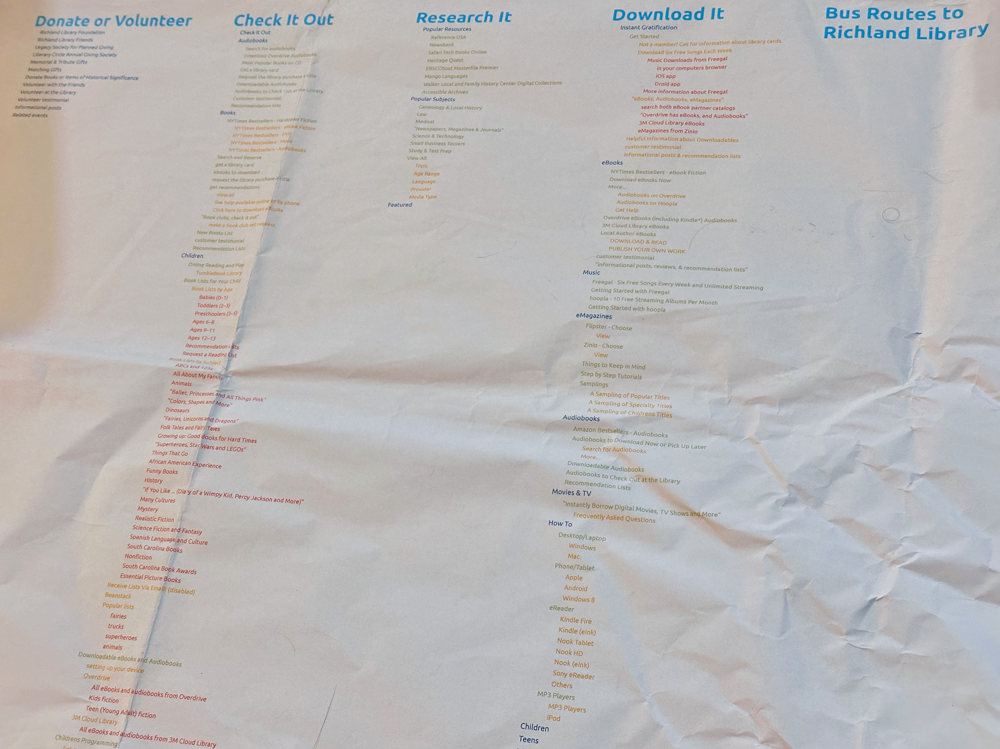

To really capture the scale of the problem, I went about writing a script to capture absolutely every single significant section of the website. I then wrote abstracted descriptions of what the link navigated to into a large database. Using a custom script, I generated the sitemap as a single page. The result was printed out on the large format printer which the marketing department happened to have access to. We had it hanging up on the wall for the remainder of the redesign project and it often shocked people to see just how many items were on it. I thought this was a good motivational tour to get people on board with redesign, or rather with re-architecting the information and was really looking forward to doing a second printout. Once the reorganization had been completed I would have enjoyed printing out the sitemap again to visually compare the two.

## Random selection

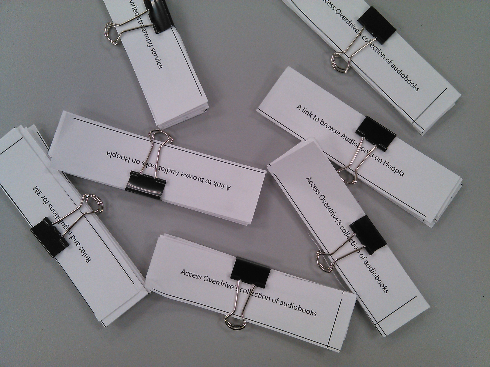

One theory I tried to entertain was that, since the cards on optimalworkshop.com were limited in size, I could conceivably run 10 cards sorts, each with 30 cards randomly selected. The categories resulting from those 10 sorts could then be put into another card sort to reduce the count further. The iterative reduction method didn’t work particularly well probably because people are not computers and the sample sets didn’t have enough overlap. I’m speculating that each of the sorts should’ve had at least a third overlapping with another sort in terms of card selection, which would’ve meant we needed no less than 13 sorts. That’s not a huge number but still the final sort of the categories wasn’t going to be in context with the rest of the exercises to write another way, hiding the entire rest of the process from participants that they didn’t understand why the categories actually came from.

## Iterations & Deception

With the only reasonable explanation about where categories and sorting methods came from to be pointed at me, both my colleagues and participants had a hard time, excepting the cards that they were given were the correct cards, and the categories had, in fact, been chosen by me not random paper published in example.com proposed an iterative card sort method which I found rather compelling the paper does not explicitly say to be deceptive only that iteratively passing assort from one participant into the next yields better results I took the reasoning to this, which is somewhat covered in the conclusion of the paper to be that the reason this works is because participants have someone else to blame whether that person actually exist or not doesn’t matter, so yes, I lied I lied to people that there was someone who would just come before them who had chosen the cards and categories, and then 10% of the samples that had been randomized by computer, and their job was simply to put things back in place The truth was that while cards had been somewhat previously sorted or not sorted at all, the cards were never randomly buried from the previous iteration, and in fact, participants were just being given a few cards here, and there to add to the existing set.

## Nodes & Edges

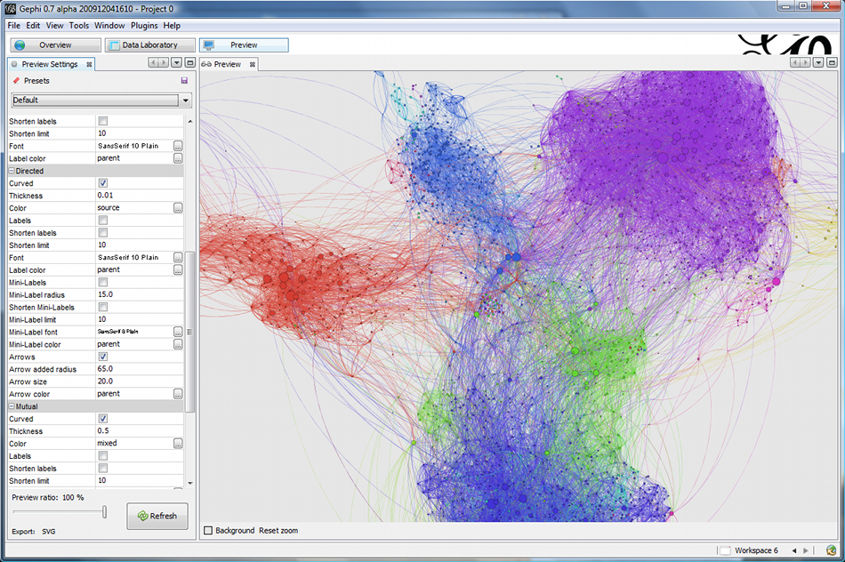

By the end, the card sort result from optimalworkshop.com had been long abandoned due to its 30 card limitations. even if we had paid for a more premium tier, our card set was just too large for the platform, so I had started searching around For alternative tools. I believe that I used Airtable to capture results which were subsets of about 100 cards at a time I could’ve easily used Google Docs or some other spreadsheet tool. The reason for choosing Airtable was that it made calculations rather easy to do category the work that the optimal workshop card sorting tool does of coating and combining categories that people write down a process much better done by hand anyway, so the usefulness of the tool, but spoke to that particular task, began to erode, and I found myself using spreadsheets more and more often anyway after reading yet another interestingpaper byexample.com hi that touched on treating card sorts more as Craft and implementing graph theory I started looking for tools that could more easily manipulate graph relationships. I was particularly fond of the Facebook graph and when I started diving into graph theory around that time maybe 2012 or so I found the subject really interesting and probably the right solution for the problem, there were already existing graph databases, and I even took a neo for Jay for a spin on the set that is that I completed the research with would like to revisit it at some point the tool that ended up being the most useful and is still my preferred method is a combination of Google spreadsheets and a graph manipulation tool called Gephi.

## Final Result

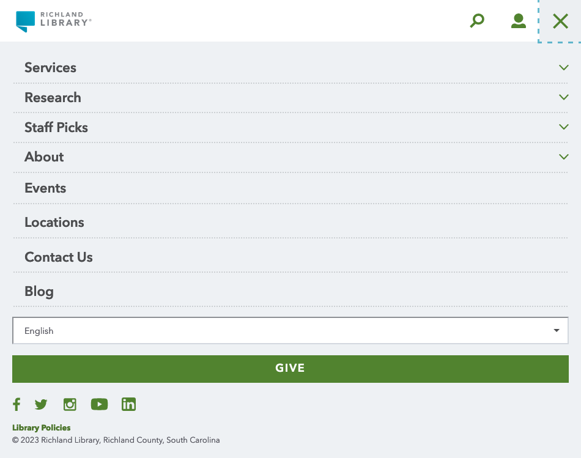

With limited sample sizes with a substantial amount of overlap with a little bit of iteration combined with deception, and with mini months of repeated card sorting with immeasurable number of participants I was able to reduce the richlandlibrary.com main navigation down to approximately 12 categories. Further research with the assistance of a major design firm Aten expanded the main menu a bit more into its final form.
