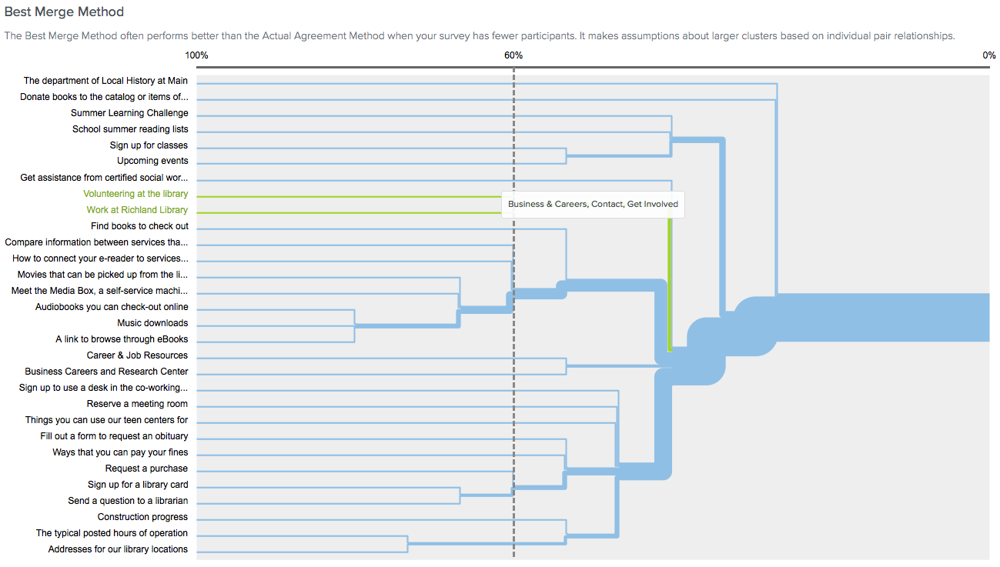

---
{
	"title": "Card Sorting The Richland Library Information Architecture",
	"date": "2016-08-18",
	"client": "Richland Library"
}
---

# {{ $page.title }}

Hands-down the biggest card sort I have ever conducted was for [richlandlibrary.com](https://richlandlibrary.com). I conducted countless usability tests between 2015-2018 which ultimately led to a website redesign. The marketing department and librarians from the 12 (at the time) locations, all had vested interests in their own sections featured either in the main menu or on the front page. As such this was a very touchy subject internally, requiring feedback and involvement from a lot of people. Since the user base of richlandlibrary.com was at the time in the tens of thousands a day and in the top 1 million most viewed websites on the web, we figured that a non-zero amount of usability research with customers was necessary.

## Selecting The Cards

I collected the most trafficed sections of the site based on analytics as well as the original main menu items. There was also a push for improving the events calendar, and I noticed that the same age groups were repeated in the browsing sections as well as for filters, and figured we could deduplicate those cards somehow, and thus they were worth including. We started with paper, using labels verbatim. There were 90 cards.

## The Beauty of the free online 30 card sort

After the initial pass on paper, we felt we could reduce the number of cards to make tests go faster. The first way to make the sorts smaller was to separate the concerns between the events calendar efforts and the rest of the website. The second way, was by conducting just enough paper sorts to figure out what was obvious so we could reduce the number of cards to 30. Somewhere between 20 and 40 and no more than 120 seems to be the sweetspot, and 30 cards happens to be the limit of cards when using [Optimal Workshop](http://optimalworkshop.com) on a free account. We chose Optimal Workshop not only because it had a free tier, but at the time was the most feature rich, and tested as the easiest tool to use for staff and customers.

_The links below point to archive.org snapshots._

<ol class="grid-of-cards">
  <li><a href="https://web.archive.org/web/20180428192407/http://www.richlandlibrary.com/download-it/ebooks">A link to browse through eBooks</a></li>
  <li><a href="https://web.archive.org/web/20180428192407/http://www.richlandlibrary.com/jobs">Business Careers and Research Center</a></li>
  <li><a href="https://web.archive.org/web/20180428192407/http://www.richlandlibrary.com/research-it/career-job-resources">Career &amp; Job Resources</a></li>
  <li><a href="https://web.archive.org/web/20180428192407/http://www.richlandlibrary.com/ask-us/answer/462867">Fill out a form to request an obituary</a></li>
  <li><a href="https://web.archive.org/web/20180428192407/http://www.richlandlibrary.com/check-it-out/books">Find books to check out</a></li>
  <li><a href="https://web.archive.org/web/20180428192407/http://www.richlandlibrary.com/events">Upcoming events</a></li>
  <li><a href="https://web.archive.org/web/20180428192407/http://www.richlandlibrary.com/events">Sign up for classes</a></li>
  <li><a href="https://web.archive.org/web/20180428192407/http://www.richlandlibrary.com/check-it-out/movies">Movies that can be picked up from the library</a></li>
  <li><a href="https://web.archive.org/web/20180428192407/http://www.richlandlibrary.com/careers">Work at Richland Library</a></li>
  <li><a href="https://web.archive.org/web/20180428192407/http://www.richlandlibrary.com/research-it/genealogy">The department of Local History at Main</a></li>
  <li><a href="https://web.archive.org/web/20180428192407/http://www.richlandlibrary.com/download-it/music">Music downloads</a></li>
  <li><a href="https://web.archive.org/web/20180428192407/http://www.richlandlibrary.com/request-purchase">Request a purchase</a></li>
  <li><a href="https://web.archive.org/web/20180428192407/http://www.richlandlibrary.com/check-it-out/audiobooks?menu=download-it">Audiobooks you can check-out online</a></li>
  <li><a href="https://web.archive.org/web/20180428192407/http://www.richlandlibrary.com/ask-us">Send a question to a librarian</a></li>
  <li><a href="https://web.archive.org/web/20180428192407/http://www.richlandlibrary.com/download-it">Compare information between services that offer e-magazines</a></li>
  <li><a href="https://web.archive.org/web/20180428192407/http://www.richlandlibrary.com/locations">Addresses for our library locations</a></li>
  <li><a href="https://web.archive.org/web/20180428192407/http://www.richlandlibrary.com/locations">The typical posted hours of operation</a></li>
  <li><a href="https://web.archive.org/web/20180428192407/http://www.richlandlibrary.com/ask-us/answer/489830">Sign up for a library card</a></li>
  <li><a href="https://web.archive.org/web/20180428192407/http://www.richlandlibrary.com/services/reserve-room">Reserve a meeting room</a></li>
  <li><a href="https://web.archive.org/web/20180428192407/http://www.richlandlibrary.com/summer">Summer Learning Challenge</a></li>
  <li><a href="https://web.archive.org/web/20180428192407/http://www.richlandlibrary.com/sites/default/files/media-room/meet_the_media_box_faqs_april_2015_0.pdf">Meet the Media Box, a self-service machine for new release movies and games</a></li>
  <li><a href="https://web.archive.org/web/20180428192407/http://www.richlandlibrary.com/donate-or-volunteer">Volunteering at the library</a></li>
  <li><a href="https://web.archive.org/web/20180428192407/http://www.richlandlibrary.com/donate-or-volunteer">Donate books to the catalog or items of historical significance for archiving</a></li>
  <li><a href="https://web.archive.org/web/20180428192407/http://www.richlandlibrary.com/services/reserve-room">Sign up to use a desk in the co-working space</a></li>
  <li><a href="https://web.archive.org/web/20180428192407/http://www.richlandlibrary.com/check-it-out/teens">Things you can use our teen centers for</a></li>
  <li><a href="https://web.archive.org/web/20180428192407/http://www.richlandlibrary.com/download-it">How to connect your e-reader to services like Amazon, Hoopla, or Zinio</a></li>
  <li><a href="https://web.archive.org/web/20180428192407/https://www.richlandlibrary.com/ask-us/answer/638981">Ways that you can pay your fines</a></li>
  <li><a href="https://web.archive.org/web/20180428192407/http://www.buildingyourlibrary.com">Construction progress</a></li>
  <li><a href="https://web.archive.org/web/20180428192407/http://richlandlibrary.com/services/social-work">Get assistance from certified social workers with health insurance, housing, etc.</a></li>
  <li><a href="https://web.archive.org/web/20180428192407/http://www.richlandlibrary.com/inform/school-summer-reading-lists-2016">School summer reading list</a></li>
</ol>

## Responses

The sample size was small, at about a 20 participants I believe. I was sure to mix both staff and random customers I would pull off to the side for 15 minutes or so. I recommend small mixed samples to anyone starting from zero usability testing data as it's a good way to show colleagues and stakeholders how their ideal solutions match up with their end users mental models. And, to stay within the limits of the free tier, I would run the study once on internal stakeholders, get the output, duplicate, and then run it again.

The responses converged on 2 major categories as evidenced by the dendrograms below:

1.  "General Resources" (the catalog)
    

2.  "Library Information" (the library itself)
    

No real surprises there. Though, it was interesting that this was not how the website was organized already. There were also various minor categories.

1.  Get Involved (volunteering/working at the library)
    

2.  Business and Careers (volunteering/working elsewhere)
    

3.  Events
    

Last, there were disagreements that fell outside of the above categories. The benefit of having a larger sample size is that these problem areas would have been more easily resolved by seeing overwhelming trends that reduce their impact.

- 50% Library Locations & construction updates
- 50% Sign up for a library card & Request an obituary
- 50% Ask a librarian & Request an obituary
- 46% Career and Job Resources & Social Worker Assistance
- 40% Hours of Operation & Construction updates
- 38% Request a Purchase & Finding Books

# Going Big

The 30 card sort would pave the way for a much larger one, but since card sorts start to break down past 30 cards, some creative solutions were necessary. Another limitation I had to work with was that there was still basically zero budget.

## Capturing The Sitemap

To really grasp the scale of the problem, I went about writing a script to capture absolutely every single significant section of the website. There were over 300 items. I then wrote abstracted descriptions of what the link navigated to into a large database. Using a custom script, I generated the sitemap as a single page. The result was printed out on the large format printer which the marketing department happened to have access to. We hung it up on the wall for the remainder of the redesign project. The poster often shocked people seeing just how big it was, and I thought this was a good motivational tool to get people on board with re-organizing the whole website.

_In hindsight, I should have kept the script on hand. Now that the redesign is complete, I would have enjoyed generating the sitemap again to visually compare the two._

## Paper, Spreadsheets, and Graph Theory

By this point, we had paid for 1 optimal workshop study to get more participants & cards, but each one cost $100, and if we made mistakes we'd have to pay for another one. Optimal Workshop also couldn't handle hundreds of cards. So we returned to paper, spreading cards out on large tables.

A wonderful research paper by Celeste Paul titled [Analyzing Card-Sorting Data Using Graph Visualization](https://www.celestelynpaul.com/files/p14jus.pdf) struck a chord with me, so I began hunting for an appropriate tool. I was particularly fond of graph theory since 2013 when [Facebook Graph Search](https://en.wikipedia.org/wiki/Facebook_Graph_Search) came out. I even dabbled a bit in [Neo4j](https://neo4j.com/) and [ArangoDB](https://arangodb.com/) to see if either could more easily process the card sort results more easily, but there weren't intuitive user interfaces built in to do what we were doing and I was running out of time. Finally settled on processing the data in in an open source desktop application called [Gephi](https://gephi.org/). It ended up being the most useful and most user friendly. My preferred method of grouping card sort results is still just a paper sort, a Google Docs spreadsheet, and Gephi. I'll have to write another article about just that, as it is a method that's been refined a few times since 2018.

## Final Result

With many months of repeated card sorting with immeasurable number of participants I was able to reduce the richlandlibrary.com main navigation down to approximately 12 categories. I presented the results during the process of the redesign project kicked off development. Further research with the assistance of a major design firm Aten expanded the main menu a bit more into its final form which launched in 2019, seen above.
