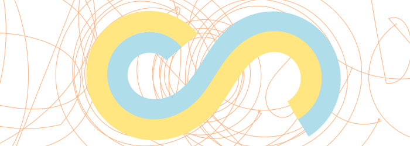

---
{
	"title": "A Love Letter To The Spiro Spline",
	'date': '2021-08-27',
	'tags': ['inkscape']
}
---

A young man by the name of Raph Levien finished his thesis in 2009 outlining a new algorithm for eye-pleasing curves, and the entire history of all the algorithms that came before it. As someone who spent countless hours fiddling with Bezier curves in Photoshop, Flash, Illustrator, 3ds max, and later in my open source phase Blender and finally Inkscape, I was all too familiar with the limitations and reliability of Bezier's formula. But I had no clue how it worked. Inspired by Raph's thesis, I've now given multiple talks on the history of vector curves. The most notable factoid is that it was invented first not by Pierre Bézier, but another frenchman Paul de Casteljau. Don't you hate stories like that? I do. Anyway, if we skip the history lesson and the mathematics, there's a fantastic ending that I want to gush about: Raph did not stop at pure formula. He wrote software that we could use. He didn't just write a proof of concept application, he embedded the algorithm into Inkscape himself. It's probably been installed on your computer for the past decade and you never thought Inkscape had any features worth noodling with. But it does; the spiro spline is the single best illustration tool that I've ever found.

First of all, it's borky
You're not going to nail using spiro on day 1. But you probably struggled with Casteljau's curves too, right? In the beginning, it's hard to pick up. This is partly due to a lack of clear controls in Inkscape, and not entirely on us as users. Bear with me. The results are worth the pain. Also, on the subject of pain, spiro, unlike cubic spline invented by the two frenchmen, is borky. It doesn't always resolve to the same exact curve given a set of points. You can break it. This will freak you out. I've gotten used to it over the years, and occasionally even learned to harness the chaos. Again, bear with me. The results are worth the pain. With that out of the way, let's dive in.

