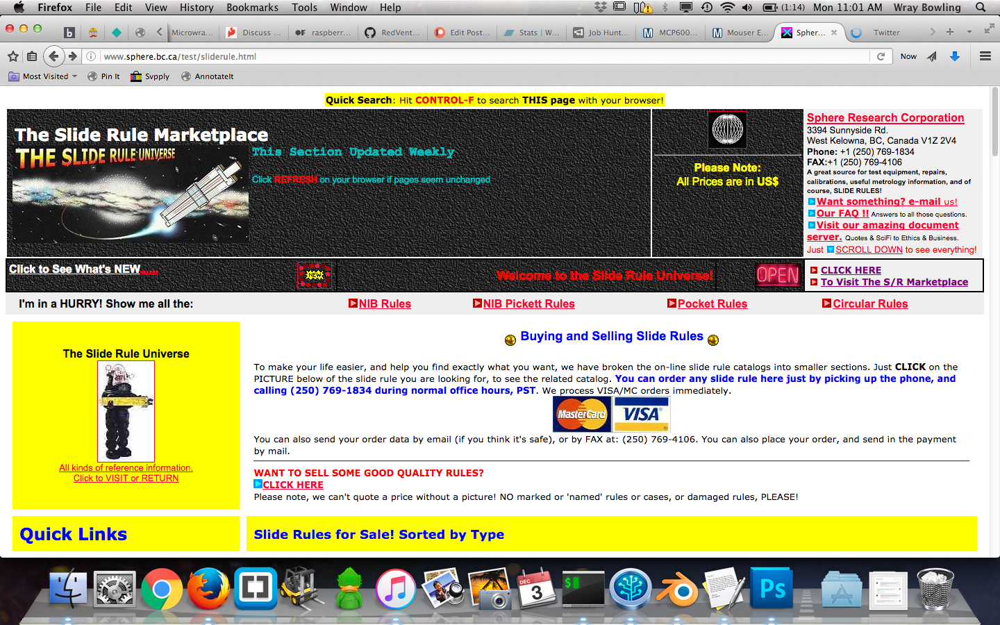

# The Museum of Usable Art
Usability is all too often made synonymous with design-by-number Swedish grids. Behold this museum of web pages made by visionaries who, in their wisdom or perhaps frustration, and most definitely in their perserverance, made web pages that are very much usable yet make "designers" cry. Just because it's "ugly" doesn't mean it isn't good. Back off, Swedes!

[Sphere's Sliderule Marketplace](http://www.sphere.bc.ca/test/sliderule.html)

I've got words for this site: engaging. loud. space age. promises of organizational super powers. delivery on those promises. I love this site. It should be in a museum. OH WAIT IT IS.

