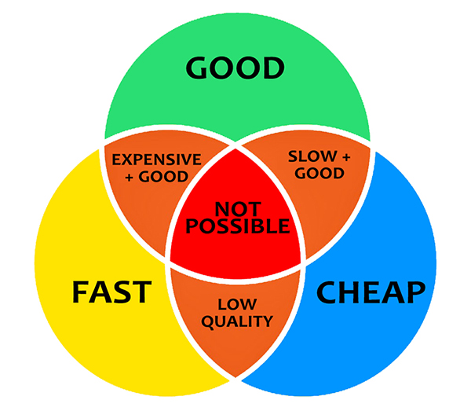
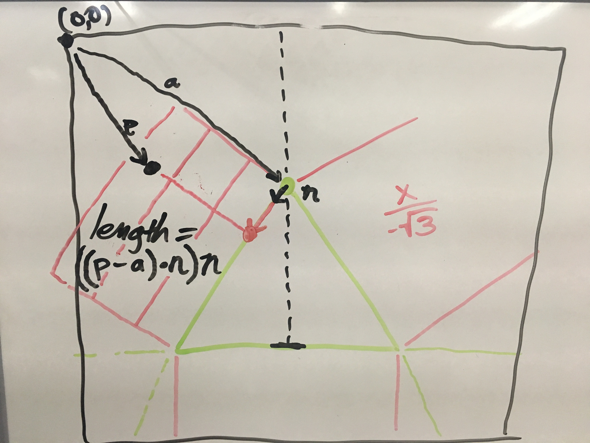

# {{ $page.title }}

A range slider is a commonplace user interface element that has only recently made its way into HTML forms. In an effort to capture richer data from end users, I set out to create a range slider that offers a third option. The result is below.

<RangeSlider3/>

## The Problem

Three is a very useful number when trying to establish a [pecking order](https://en.wikipedia.org/wiki/Pecking_order), discovering taxonomic hierarchy, or tree structure. When presenting a user with a set of choices to balance a range slider is the most intuitive way of capturing a normalized weight. The only existing interfaces for more than two items were checkboxes which offer no weights, multiple select boxes which are clumsy and offer no weights. While I could have presented the user with three separate sliders, this doesn't help the data analyst trying to quantify the user's answer.

## Intended Use

The three-way range slider is intended to be used in cases where the user needs to allocate arbitrary amounts to any of three choices but should be limited to a finite quota. It was originally developed to be used in [JoyStation](https://github.com/rcpl/JoyStation/).

## Failed Attempts

Here's a list of things I tried that didn't work:

<iframe width="640" height="360" frameborder="0" src="https://www.shadertoy.com/embed/Xl2yDW?gui=true&t=10&paused=true&muted=true" allowfullscreen></iframe>

1. [A signed distance function](https://www.shadertoy.com/view/Xl2yDW)
1. [Multi-Dimensional Matrices](http://mathjs.org/docs/datatypes/matrices.html)
1. [Point in polygon](http://blackpawn.com/texts/pointinpoly/default.html)
1. [Yet another signed distance function](http://thebookofshaders.com/edit.php?log=180118181551)
1. [Distance from a point to a line](https://en.wikipedia.org/wiki/Distance_from_a_point_to_a_line#Vector_formulation)

## The Math

I'm sure no one else cares to know how to make a slider that's tilted √3 or negative √3 depending on which side of the triangle you're closest to, or how to efficiently snap the sliding dot to the nearest corner if you're dragging in the fan-shaped area around that point, and then smoothly transition into sliding along the next edge if you make a 60 degree turn around the corner...but here's how it works anyway. _Warning: everything was rendered to an SVG which means that positive Y goes down, and every math equation you'll find online has positive Y going up._

The regions outside of the triangle split up into sides and corners

for the left side, the slope is 1/sqrt(3). the right side is just the negative of that. In regular math coordinates, these would be reversed, but remember that graphics coordinates are vertically flipped.

if the event point is less than either of the red lines, just snap to the apex. This is cheaper than calculating distance.

To determine the point along the sloped sides, the new vector (p-a).dot(n).multiply(n) where n is a unit vector of AB (from the apex to the base, with with a length of one) To write it another way, n = B.subtract(A).normalize() which could also be called "the angle" and (p-a).dot(n) could be called "the length from A" the mutiplication of the two results in a point projected onto the line.
