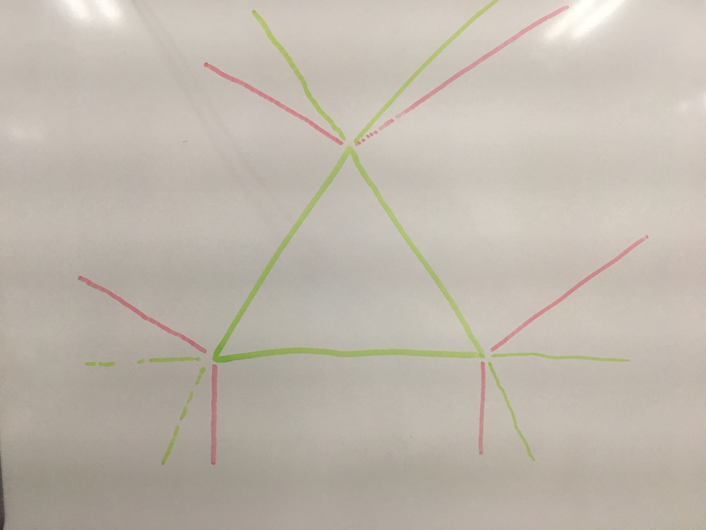
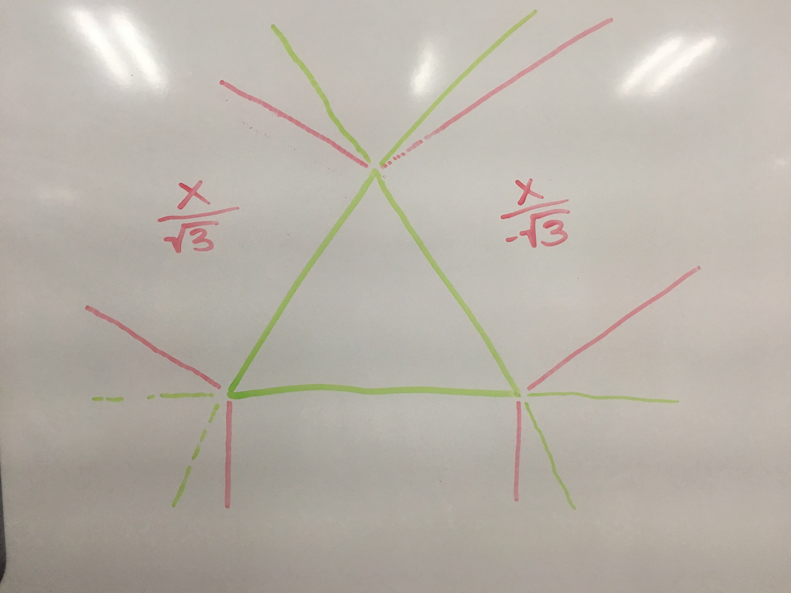
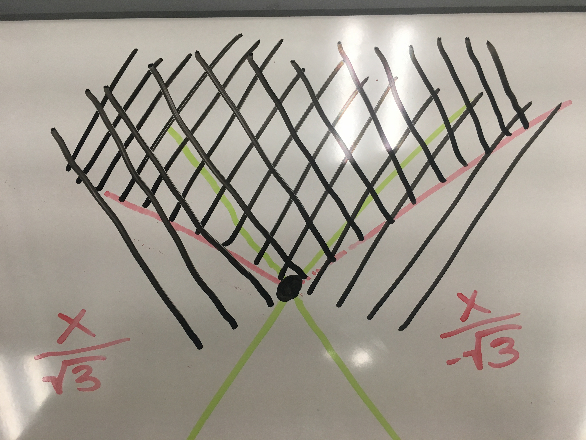

---
{
	"title": "Why I Built a 3-Way Range Input",
	"date": "2018-01-18"
}
---

# {{ $page.title }}

## what is it?
Do you know the square root of 3? Well, I didn't either last week and now I know it to 4 or 5 decimal places. I set out to make something that just plain didn't exist in the User Interface world: a 3-way slider. Why? Because 3 is a really really good number. If you're raising chickens, it's called "pecking order."
## false assumptions
I expected users to be less extreme with their responses. While there's nothing stopping them from answering with a landslide to a single option, this returns data that is just as binary as if I'd provided them with a much simpler user interface: a radio button.
Ratios are somewhat useful, but the deductive reasoning required to turn those ratios into a global scale are challenging to make use of.

## what i'd do different next time
Character building interfaces like this one from NBA Hangtime allow the user a finite number of points that they can fill up different atributes with. It's impossible to not use up all the points or to stuff one attribute with all of your available points. This system is also much less tedious as more than three options can be weighted simultaneously.
## reality of this project
A linear slider turned out to be a better choice for a variety of reasons, but the biggest of all is that browsers already natively support them. Collecting data in any way took priority over perfecting the method of collecting those data points, and a 1-dimensional spectrum satisfied my desire to capture a value with high precision.
## a video

## Unexpected challenges and how I adapted my process
Limiting a slider to a triangular area is not a trivial task.

Why did this take four-ish days, and help from my friend Stephen? Because linear algebra is hard. Here's a list of things I tried that didn't work:

1. [https://www.shadertoy.com/view/Xl2yDW](https://www.shadertoy.com/view/Xl2yDW)
1. http://mathjs.org/docs/datatypes/matrices.html
1. http://blackpawn.com/texts/pointinpoly/default.html
1. http://thebookofshaders.com/edit.php?log=180118181551
1. https://en.wikipedia.org/wiki/Distance_from_a_point_to_a_line#Vector_formulation

I'm sure no one else here cares to know how to make a slider that's tilted √3 or negative √3 depending on which side of the triangle you're closest to, or how to efficiently snap the sliding dot to the nearest corner if you're dragging in the fan-shaped area around that point, and then smoothly transition into sliding along the next edge if you make a 60 degree turn around the corner

But here's how it works:

Warning: everything was rendered to an SVG which means that positive Y goes down, and every math equation you'll find online has positive Y going up. It's confusing.

