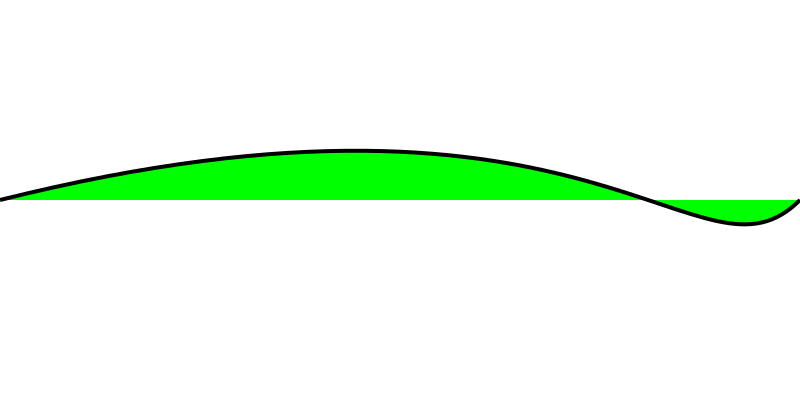

---
{
	"title": "The Ultimate Content Filter",
	'date': '2018-12-13',
	'tags': ['user interface']
}
---

Content needs filtering, pretty much all the time. Welcome to yet another instance where I saw a need for borrowing a user interface from the audio production world. You know what makes a whole lot of sense for advanced filtering? Parametric EQ. It's the gold standard, and yet I've never seen it outside of audio or photo manipulation tools.

## What would happen if we tried to use a Parametric EQ on a set of data other than audio frequencies or color channels? Let's find out.

