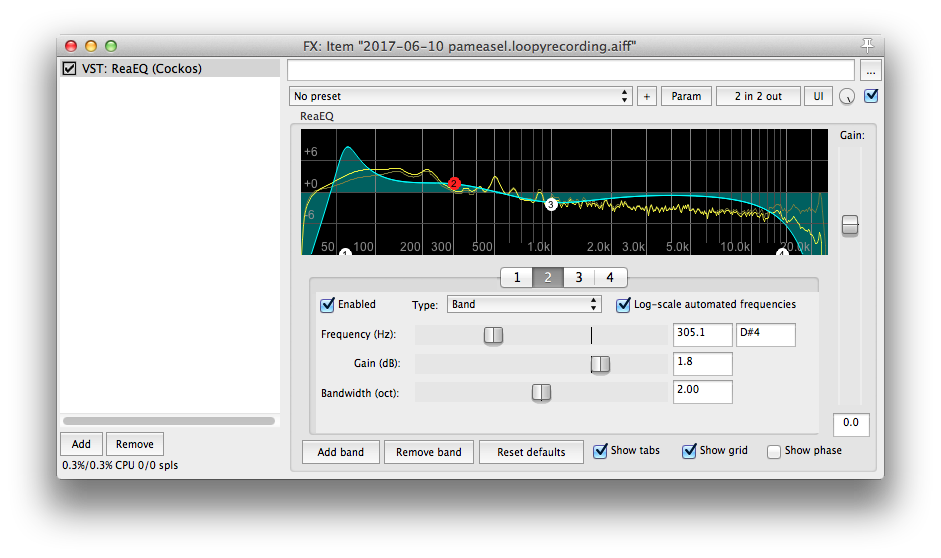
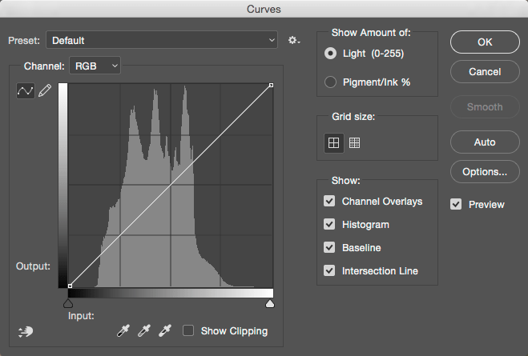
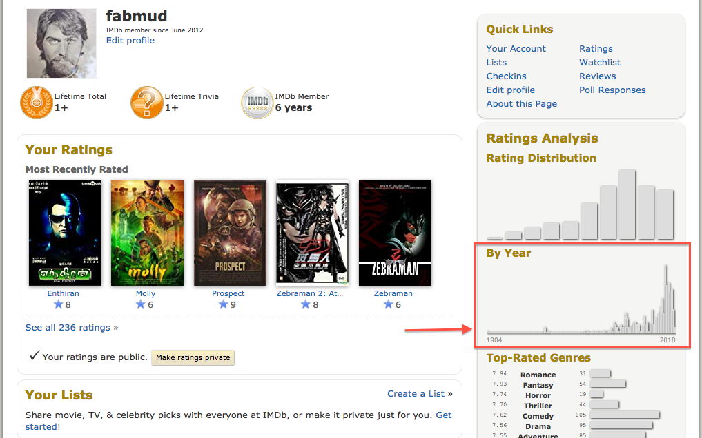
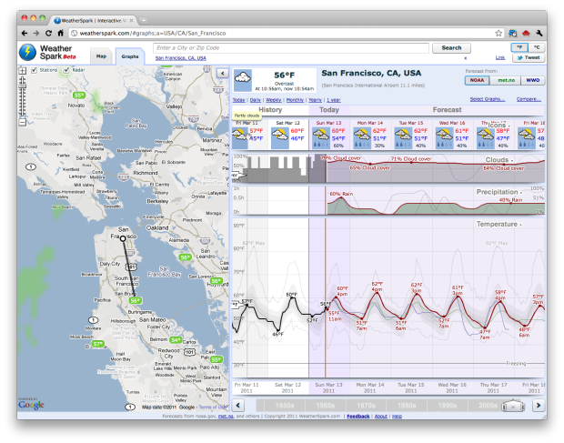

---
{
	"title": "The Ultimate Content Filter",
	'date': '2018-12-13',
	'tags': ['user interface']
}
---

## What would happen if we tried to use a Parametric EQ on a set of data other than audio frequencies or color channels? Let's find out.

Content needs filtering, pretty much all the time. Welcome to yet another instance where I saw a need for borrowing a user interface from the audio production world. You know what makes a whole lot of sense for advanced filtering? Parametric EQ. It's the gold standard, and yet I've never seen it outside of audio or photo manipulation tools.

If our content is labelled with a bunch of tags for example, parametric filtering won't work. This blog post is funny? You tagged it as funny? Okay, but *how funny is it?* If we can normalize the funniness of the blog post against all other blog posts, then we can make use of parametric eq. But we can't use the entire spectrum of numbers between low and high (infinity). The comporimise is to use buckets. Ultimately your content won't need to change, but how the metadata is recorded will become *more graphy* Each connection from content to content type will have a weight. IMDb provides users with a histogram to visualize the movies they've seen and what year they were released. This is useful as a visualization tool, but its interactivity leaves a lot to be desired. An on/off analogy might be "new" versus "not new" movies which of course breaks down as time keeps moving forward.

And this starts to beg the question: Is time the only thing we're willing to have as the x-axis to a trend?

